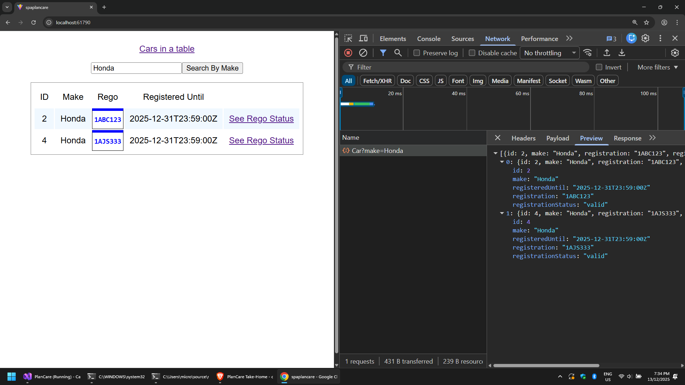
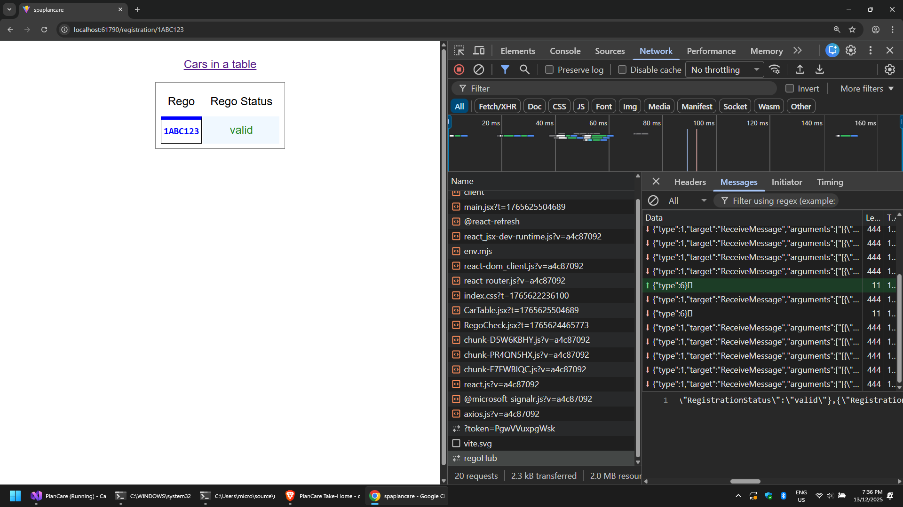

# PlanCare coding test by Cameron

There are two projects in this solution.

* [./PlanCare](./PlanCare) is a ASP.NET API with a [CarController](./PlanCare/Controllers/CarController.cs) that provides a list of [cars](./PlanCare/Model/Car.cs). It has a SignalR [background service](./PlanCare/RegoBackgroundService.cs) that updates clients with car registration statuses.
* [./spaplancare](./spaplancare) is a React single-page application that show a [table of cars](./spaplancare/src/components/CarTable.jsx) and uses SignalR to keep an eye on the car's [registration status](./spaplancare/src/components/RegoCheck.jsx).

## Table of cars with search by make

## Live registration status via SignalR

